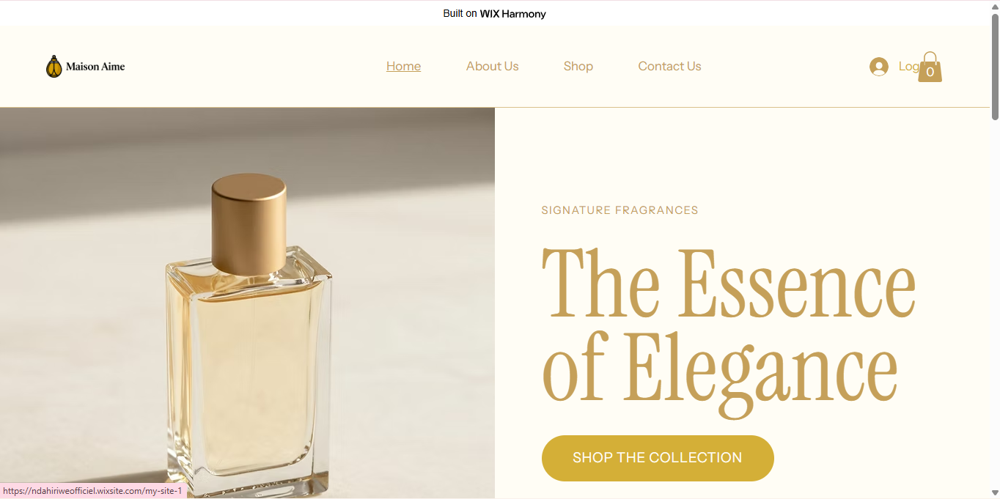
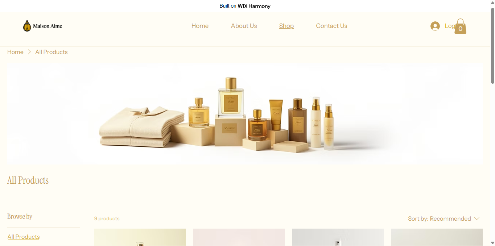
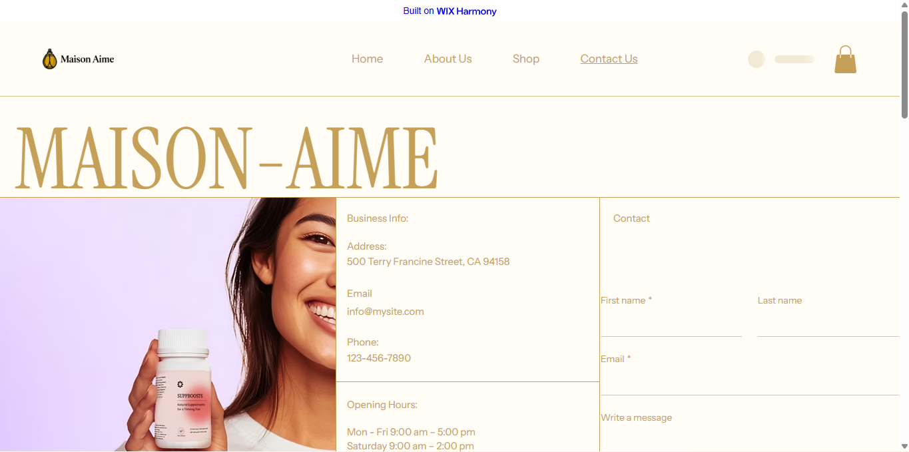
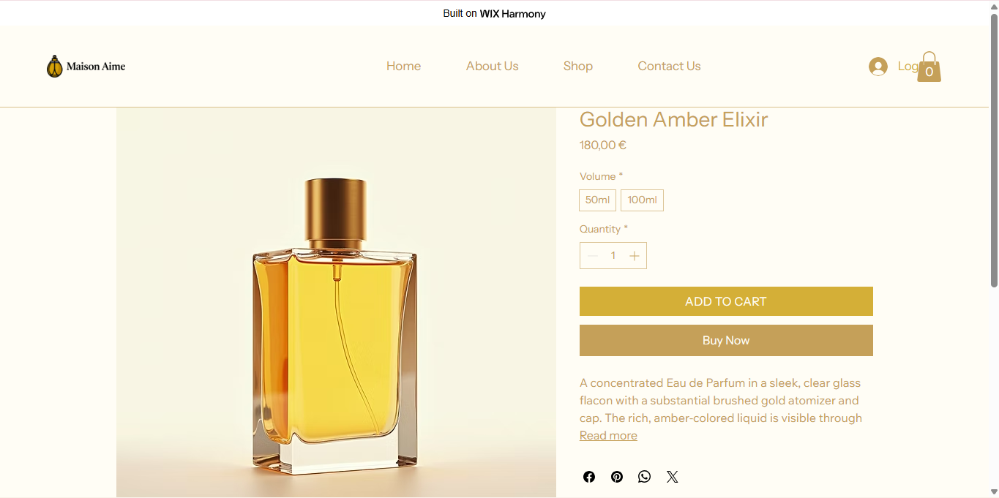

# 🕯️ Maison Aime — Luxury Fragrance & Lifestyle Store

> *"Wear your mood. Scent your world."*

---

## 👤 Student Information

| Field | Details |
|-------|---------|
| **Reg No** | 22977/2023 |
| **Course** | E-Commerce and Web Application — EWA408510 |
| **Institution** | University of Lay Adventists of Kigali (UNILAK) |
| **Academic Year** | 2025–2026, Semester II |
| **Lecturer** | Eric Maniraguha |
| **Submission Date** | May 27, 2026 |

---

## 🏪 Project Title

**Maison Aime** — A luxury minimalist e-commerce store specializing in premium fragrances, scented candles, and lifestyle essentials crafted for those who appreciate elegance in every detail.

---

## 🛠️ Platform Used

**Wix** — [wix.com](https://wix.com)

Wix was selected for its intuitive drag-and-drop editor, built-in e-commerce functionality (including cart and product management), and its wide range of premium templates ideal for a luxury aesthetic. No coding was required to build a fully functional, visually polished storefront.

---

## ✨ Features Implemented

### Pages
- **🏠 Homepage** — Store name, welcome banner, featured collections, and brand statement
- **🛍️ Product Page** — 5+ luxury products with high-quality images, prices, and descriptions
- **📖 About Page** — Brand story, mission statement, and aesthetic philosophy
- **📞 Contact Page** — Contact form, email address, and social media links
- **🛒 Cart** — Add-to-cart functionality with item count and checkout simulation

### Design Features
- Luxury gold and cream color palette
- Minimalist typography with elegant serif fonts
- Responsive layout (mobile + desktop)
- High-quality product imagery
- Smooth navigation between all pages

---

## 🛍️ Products Listed

| # | Product | Price |
|---|---------|-------|
| 1 | Lumière Noire — Eau de Parfum 50ml | $89.00 |
| 2 | Dorée Candle — Amber & Sandalwood | $45.00 |
| 3 | Velours Body Mist — Rose & Vanilla | $38.00 |
| 4 | Éclat Gift Set — Perfume + Candle | $120.00 |
| 5 | Blanc Serenity — Skincare Duo | $75.00 |

---

## 📸 Screenshots

### Homepage


### Product Page


### Contact Page


### Cart Page


---

## 🔗 Links

| | Link |
|-|------|
| 🌐 **Live Website** | [Visit Maison Aime](https://ndahiriweofficiel.wixsite.com/my-site-1)
| 📁 **GitHub Repository** | [github.com/yourusername/maison-aime](https://github.com/aimemaurice/maison-aime)

---

## 🧩 Challenges

1. **Product image consistency** — Finding high-quality, cohesive images that matched the luxury aesthetic took time. Solved by sourcing from free premium stock sites (Unsplash, Pexels).
2. **Cart simulation on free plan** — Wix's free tier has limited checkout features. Worked around this by enabling the Wix Stores add-on which provides basic cart functionality.
3. **Typography matching** — Getting the font pairing to feel truly luxury (not generic) required testing several combinations in Wix's editor before settling on a refined serif + clean sans-serif pairing.

---

## 📚 Lessons Learned

- **No-code platforms are powerful** — Wix enabled building a professional storefront in a fraction of the time traditional coding would require, without sacrificing design quality.
- **Design decisions matter** — Small choices like color palette, font, and spacing dramatically impact how premium a brand feels.
- **Documentation is part of the product** — Writing a clean README taught me that presenting your work clearly is just as important as building it.
- **GitHub as a portfolio tool** — This project reinforced how GitHub can showcase non-code work like design projects, making it a valuable professional asset.

---

## 📁 Repository Structure

```
maison-aime/
├── README.md          # Full project documentation
└── images/
    ├── homepage.png
    ├── products.png
    └── contact-cart.png
```

---

*Built with ❤️ and a touch of gold — Maison Aime, 2026*
